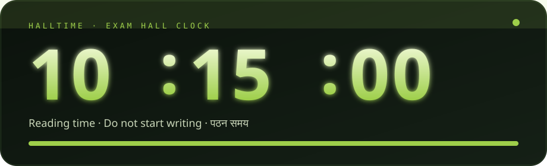
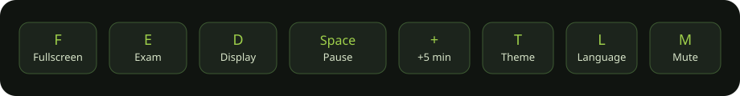
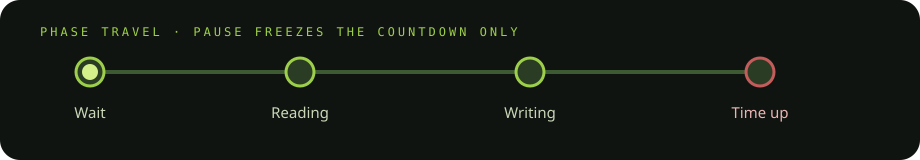
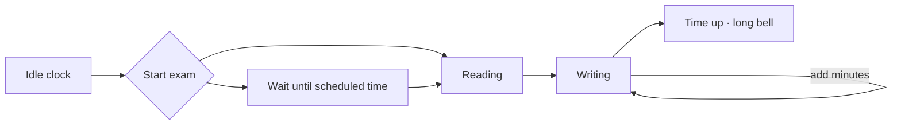

<p align="center">
  
</p>

<p align="center">
  <strong>HALLTIME</strong> is a projector-first digital clock for examination halls.<br/>
  Fullscreen. Reading + writing. CBSE morning schedule. Hall bells. English &amp; हिन्दी.<br/>
  No login. No backend. The countdown lives on the computer in the room.
</p>

<p align="center">
  <a href="https://hall-time.vercel.app"></a>
  
  
  
  
</p>

<p align="center">
  <a href="#quick-start-invigilator">Invigilator</a> ·
  <a href="#keyboard">Keys</a> ·
  <a href="#exam-engine">Exam engine</a> ·
  <a href="#display-language--sound">Display</a> ·
  <a href="#run-locally">Run locally</a> ·
  <a href="#architecture">Architecture</a>
</p>

---

## Product

HALLTIME replaces “search digital clock, hide bookmarks, hope the tab does not sleep.” It is a **board instrument**: large type, high contrast, idle chrome that disappears, and an exam state machine that invigilators can trust from the back of the hall.

| For the hall | For the invigilator |
| --- | --- |
| Seconds you can read at 15–20 m | Presets: 1h test, 3h paper, CBSE morning |
| Plain digits or LED segments | Pause the **countdown**, not the wall clock |
| Bilingual captions | Extra time in minutes or percent |
| Themes for dark projectors and bright rooms | Bells + banners if speakers are muted |
| Install as a fullscreen PWA | Share URL carries school name + theme |

**Live:** [hall-time.vercel.app](https://hall-time.vercel.app)  
**Source:** [github.com/Rishu123-png/Hall-Time-](https://github.com/Rishu123-png/Hall-Time-)

---

## Quick start (invigilator)

1. Open the page. Press **F** so students never see the browser.
2. For a wall clock, do nothing. The dock hides itself.
3. **Start exam**
   - **1 hour test** — begins when you press begin. No reading.
   - **3 hour paper** — 15 minutes reading, then 3 hours writing.
   - **CBSE morning** — reading **10:15**, writing **10:30–13:30**. Arm it **before** students enter; the board waits.
4. Extra time is **per room**. Another allowance → another window.
5. **+5 min** during the paper. **Pause** if there is a disturbance.
6. Bells play **on this computer**. Use **Test bell**. Banners still fire if audio is blocked.
7. **Blackboard** for projectors. **Daylight** for bright halls. **Plain** digits from the back row; **LED** for the classic board look.

> Match this computer to a phone **before** the paper. HALLTIME uses the device clock, not the network.

---

## Keyboard

<p align="center">
  
</p>

| Key | Action | Key | Action |
| --- | --- | --- | --- |
| `F` | Fullscreen | `T` | Cycle theme |
| `E` | Exam setup / running sheet | `L` | English ↔ हिन्दी |
| `D` | Display | `M` | Mute bells |
| `Space` | Pause / resume | `Esc` | Close, then exit fullscreen |
| `+` / `=` | Add 5 minutes | Double-click | Fullscreen |

Shortcuts ignore keystrokes inside text fields.

---

## Exam engine

<p align="center">
  
</p>



**Start now** — reading chips `0–20` min, writing `45–180` or custom `5–360`.  
**Set times** — 24-hour inputs. Reading before writing. End after start. Past ends are rejected.  
**Extra** — `0 / +15 / +20 / +30 / +60 / +25% / +50%` or a stepper.  
**Persistence** — `localStorage` key `halltime-v1`. Reload restores the paper; a one-shot session banner confirms it.  
**Leave guard** — the browser warns if you close a live exam that is not yet “time up.”

---

## Display, language & sound

<details>
<summary><strong>Themes, digits, clock</strong></summary>

- Themes: Blackboard · Daylight · Amber · Green · Red  
- Digits: Plain (distance) or LED (seven-segment)  
- 12 / 24 hour, seconds, blinking colon, date line  
- Query string: `?theme=blackboard&lang=hi`

</details>

<details>
<summary><strong>Language</strong></summary>

- English or हिन्दी from Display (`L` to toggle)  
- **English and Hindi together** for mixed halls  
- School / centre, paper title, notice, corner brand (or hide brand)

</details>

<details>
<summary><strong>Hall bells</strong></summary>

Web Audio oscillators (no MP3s). Volume: Quiet · Room · Loud.

| Cue | Default |
| --- | --- |
| Reading begins | Short |
| Writing begins | Long |
| Every hour of writing | Short |
| 15 minutes left | Short + banner |
| 5 minutes left | Short + banner |
| Time up | Long + banner |

Browsers may block audio until a click — **Test bell** unlocks the context.

</details>

---

## Run locally

Static files. A real HTTP origin is required (`file://` will not register the service worker).

```bash
git clone https://github.com/Rishu123-png/Hall-Time-.git
cd Hall-Time-
python3 -m http.server 8080
# → http://localhost:8080
```

```bash
npx serve .
```

Deploy as a static site (Vercel, Netlify, GitHub Pages). **No build step.**

---

## Architecture

```
Hall-Time-/
├── index.html               Board + exam/display sheets
├── app.js                   Clock loop, exam FSM, i18n, bells, PWA
├── styles.css               Themes, LED segments, dock, motion
├── sw.js                    Precache shell + fonts; network then cache
├── manifest.webmanifest     display: fullscreen
├── fonts/                   Barlow, Barlow Condensed, Noto Sans Devanagari
├── docs/                    README motion assets (hero, keys, flow)
├── icon.svg · icon-192.png · icon-512.png
└── README.md
```

| Concern | Implementation |
| --- | --- |
| Runtime | Vanilla IIFE, `requestAnimationFrame` |
| Theme FOUC | Inline boot script reads `localStorage` + query |
| Audio | Web Audio API |
| Stay awake | Screen Wake Lock, re-acquired on `visibilitychange` |
| Offline | `sw.js` precache + fetch fallback to `index.html` |
| Share | URL encodes school + theme for the hall PC |

### Quality gate (this tree)

| Check | Result |
| --- | --- |
| `node --check app.js` | Pass |
| `manifest.webmanifest` | Valid JSON |
| Fonts vs service worker list | 7/7 `.woff2` |
| Cloudflare scrape residue | Removed from `index.html` |

**Not bugs:** fullscreen and autoplay need a gesture; clipboard may fall back to select-to-copy; time is the **device** clock.

---

## Design rules

1. **Readable at distance** — condensed weight, generous tracking, no clutter in exam mode.  
2. **Chrome yields to the clock** — dock autohides; idle hint expires.  
3. **Fail visible** — banners even when bells are muted.  
4. **One room, one extra-time policy** — split rooms = split windows.  
5. **Offline after first paint** — the paper must not die with the Wi-Fi.

---

## Fonts

Barlow & Barlow Condensed (Barlow Project Authors) and Noto Sans Devanagari (Google) — **SIL Open Font License**. The maker line on the board can be hidden in Display.

---

<p align="center">
  <sub>Made by <strong>Rishu Jaswar</strong> · HALLTIME · open it, press F, start the paper.</sub>
</p>
